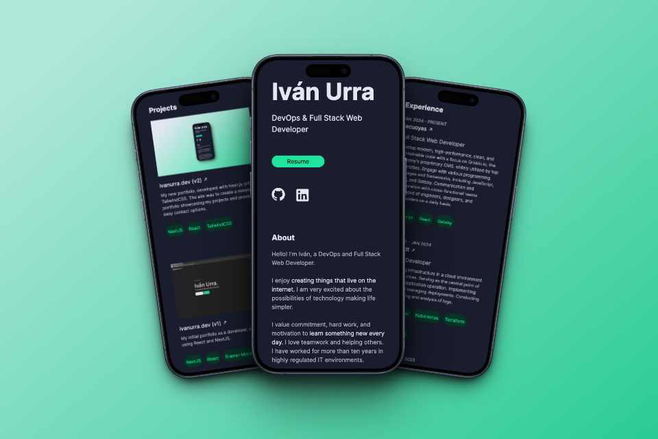

## portfolio v2

The second iteration of ivanurra.dev built with NextJS & TailwindCSS and hosted with Vercel.



## Getting Started 🚀

- Install all dependencies described in package.json:

```
$ yarn install
```

- Run the development server:

```bash
yarn dev
```

- Open [http://localhost:3000](http://localhost:3000) with your browser to see the result.

## Deployment 📦

https://ivanurra.dev

## Built with 🛠️

- [NextJS](https://nextjs.org/) - Open-source React front-end development web framework.
- [React](https://reactjs.org/) - Open source Javascript library designed to create user interfaces on a single page.
- [TailwindCSS](https://tailwindcss.com/) - Tailwind CSS is an open source CSS framework for web design.
- [Vercel](https://vercel.com/) - For deployment.

## Author ✒️

- **Iván Urra** - [ivanurra](https://github.com/ivanurra)

## License 📄

Copyright (c) Iván Urra

MIT License.
